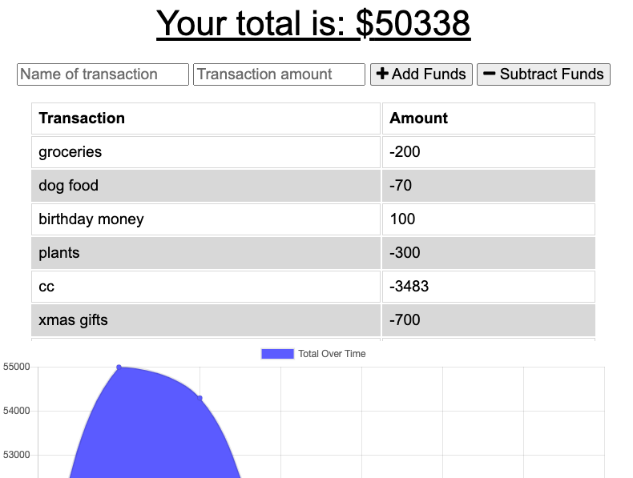

# Offline Budget Tracker

## Description

This app has installed a PWA package so the user can make changes to their budget while they are offline and the changes will update in the database once they connect again.

## Table Of Contents:

-[Installation](#Installation)   -[Usage](#Usage)   -[Liscense](#Liscense)   -[Contributing](#Contributing)   -[Tests](#Tests)   -[Questions](#Questions)

## Installation

npm i - to install dependencies, and npm start - to connect to the server

## Usage

  
[Video showing the functionality of the offline transactions being successful](https://drive.google.com/file/d/1SJVl3ZaCzfeIULL9n4cnOsCCQe0NNPyz/view)

## Liscense

For more information about the liscense chosen, follow the link below:
[Liscense](https://opensource.org/liscenses/MIT)

## Contributing

Amy Moseman -
NodeJs  
Express  
Mongoose  
MongodAtlas  
Heroku  

## Tests

N/A

## Questions

If you have any questions about this repo, open an issue or contact me directly at **amoseman18@gmail.com**.  
You can find more of my work at Github: [amoseman1](https://github.com/amoseman1/)

